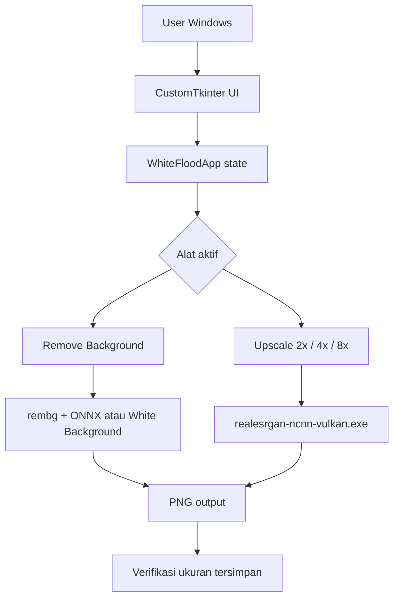

# Arsitektur WhiteFlood BG Remover & Upscaler

## Status dokumen

Dokumen ini adalah baseline arsitektur berdasarkan source, `README.md`, dan `user.md` yang ada pada 8 Agustus 2026.

Status verifikasi sebelum patch UI:

- source aktif berada di `review-temp/WhiteFlood_BG_Remover_App/whiteflood_app.py`;
- aplikasi memakai Python desktop Windows dengan CustomTkinter/Tkinter;
- alur single-image dan batch sudah terlihat di source;
- Remove Background memakai jalur `rembg`/ONNX atau mode White Background lokal;
- Upscale memanggil backend `realesrgan-ncnn-vulkan.exe` melalui subprocess;
- pemeriksaan runtime GUI, pemrosesan gambar nyata, dan build EXE tidak dijalankan saat dokumen baseline dibuat.

Perubahan patch 2026-08-08 sudah diperiksa melalui syntax check dan static smoke test. GUI, download model nyata, dan build EXE tetap belum dijalankan.

Jangan mengubah status menjadi "terverifikasi" hanya karena fungsi atau komentar sudah ada di source.

## Tujuan dan batas sistem

WhiteFlood adalah aplikasi desktop Windows lokal untuk foto produk furnitur dan katalog kantor. Aplikasi memiliki dua alat yang dipilih user secara terpisah:

1. Remove Background;
2. Upscale 2x, 4x, atau 8x.

Operasional dasar tidak memakai server aplikasi. Model AI dapat perlu diunduh pada penggunaan pertama, tetapi gambar diproses di komputer user dan hasil disimpan sebagai PNG ke path yang dipilih user.

## Bentuk sistem



## Struktur source aktif

```text
review-temp/WhiteFlood_BG_Remover_App/
|-- whiteflood_app.py       # UI, state, pipeline, single-image, batch
|-- requirements.txt        # dependency runtime Python
|-- RUN_APP.bat              # entry point singkat ke launcher tersembunyi
|-- RUN_APP.vbs              # menjalankan source dengan pythonw atau EXE tanpa console
|-- BUILD_EXE.bat            # install/build dengan PyInstaller
|-- build_exe.py             # konfigurasi command PyInstaller
|-- logo.ico, logo.png       # aset branding
`-- realesrgan/               # executable, DLL, dan model backend upscale
```

Saat ini source aplikasi masih terpusat pada satu file Python. Jangan memecahnya menjadi banyak module hanya untuk merapikan struktur; pemisahan baru perlu requirement dan verifikasi behavior yang jelas.

## Lapisan dan tanggung jawab

### UI dan state

- `WhiteFloodApp` mengelola window, sidebar, pilihan alat, pilihan mode, progress, status, preview, dan dialog file.
- `SplitSliderPreview` menampilkan gambar asli dan hasil sebelum/sesudah. Bitmap display dan checkerboard di-cache berdasarkan ukuran canvas; drag hanya menjadwalkan satu redraw ringan setiap frame.
- `active_tool` membedakan `TOOL_REMOVE_BG` dan `TOOL_UPSCALE`.
- Tombol proses, simpan, dan batch dikunci melalui state `_processing` agar proses ganda tidak berjalan bersamaan.
- Adapter `_ModelDownloadProgress` meneruskan byte download `pooch` ke progress bar UI sehingga persentase model terlihat di aplikasi.

### Single-image workflow

1. User memilih file gambar.
2. `PIL.Image.open` membaca gambar dan mempertahankan informasi alpha jika tersedia.
3. Gambar asli langsung ditampilkan sebelum proses berat dimulai.
4. Remove Background diproses dengan mode yang dipilih, atau Upscale diproses setelah user memilih skala.
5. Worker thread mengerjakan proses berat agar UI tetap merespons.
6. Callback `after` Tkinter mengembalikan status proses dan progress download model ke UI.
7. Hasil dikembalikan ke UI; user memilih `Simpan PNG`, lalu ukuran output dibaca ulang untuk verifikasi.

### Remove Background pipeline

- Mode AI memakai `ai_remove_bg`, session lazy-load, dan model `birefnet-*` melalui `rembg`.
- Mode White Background memakai `flood_remove_bg` untuk background putih/abu-abu polos tanpa model AI.
- `refine_alpha_mask` menangani penghalusan atau erosi alpha sesuai pengaturan.
- Pipeline menetapkan ukuran yang diharapkan sama dengan ukuran input.
- Hasil dikonversi ke RGBA dan disimpan sebagai PNG.

### Upscale pipeline

- `upscale_image_alpha_safe` membuat folder temporary untuk input dan output backend.
- Backend eksternal dipanggil melalui `subprocess.Popen`.
- Skala 2x atau 4x dikirim langsung ke backend; skala 8x memakai pass AI 4x lalu resize Lanczos 2x.
- Gambar dengan alpha dikembalikan sebagai RGBA; gambar tanpa alpha tetap dapat dikembalikan sebagai RGB.
- `process_file` menetapkan ukuran yang diharapkan sebagai `(lebar * skala, tinggi * skala)`.

### Batch workflow

- `process_folder` menerima PNG, JPG, JPEG, WEBP, dan BMP.
- File diproses satu per satu dalam worker thread.
- `_get_next_sequence_name` membersihkan nama batch dan mencari nomor yang belum dipakai.
- Output batch memakai pola `<nama-batch>-<nomor>.png` dan tidak boleh menimpa file yang sudah ada.
- User dapat membatalkan batch; gambar yang sedang berjalan boleh selesai sebelum worker berhenti.

### Penyimpanan dan metadata

- Tidak ada database atau penyimpanan state aplikasi yang menjadi source of truth.
- Output disimpan sebagai PNG melalui Pillow.
- `metadata_for_save` digunakan untuk membawa metadata yang didukung ke output.
- Setelah penyimpanan, ukuran file dibaca ulang. Jika berbeda dari ukuran yang diharapkan, proses dianggap gagal.

## Memory dan engine berat

- Session `rembg` disimpan lazy-load pada `_rembg_session`.
- Saat model berubah atau alat berpindah, session lama dilepas dan `gc.collect()` dipanggil.
- ONNX SessionOptions mengatur `enable_cpu_mem_arena = False` pada jalur session yang tersedia.
- RAM ditampilkan melalui `get_process_memory_mb` sebagai RSS proses.
- Angka RAM pada README adalah klaim produk sampai diukur ulang dengan environment dan input yang disebutkan; bukan bukti otomatis dari source.

Jangan menambah engine berat aktif paralel, cache model tambahan, atau proses batch paralel tanpa pengukuran dan persetujuan perubahan arsitektur.

## Packaging

- `BUILD_EXE.bat` memasang dependency dan PyInstaller, membersihkan artefak build lama, lalu menjalankan `build_exe.py`.
- `build_exe.py` membuat executable one-file windowed bernama `WhiteFlood_BG_Remover.exe`.
- `RUN_APP.vbs` memilih EXE di `dist` bila tersedia; jika belum ada, launcher memakai `pythonw.exe` untuk source agar console tidak muncul.
- Aset logo, folder `realesrgan`, metadata package, dan dependency runtime dikumpulkan ke bundle.
- Script build bersifat destruktif terhadap `build/`, `dist/`, dan file `.spec`; target harus diperiksa sebelum dijalankan.

## Aturan arsitektur yang dikunci

- Dua alat tidak boleh berjalan otomatis beriringan.
- Remove Background tidak boleh crop atau resize input.
- Upscale harus mengikuti skala yang dipilih dan menjaga alpha.
- Gambar input tidak boleh di-upload ke layanan eksternal tanpa persetujuan eksplisit.
- File output tidak boleh menimpa file lama secara diam-diam.
- Perubahan UI tidak boleh mengubah pipeline gambar tanpa regression check ukuran, mode warna, dan output PNG.
- Perubahan engine atau dependency harus dicatat di worklog dan diverifikasi pada environment Windows yang disebutkan.

## Hal yang belum menjadi bagian arsitektur

- server atau cloud processing;
- database aplikasi;
- login atau akun user;
- sinkronisasi antar-device;
- test suite otomatis khusus pipeline gambar;
- benchmark RAM lintas ukuran gambar dan mode AI;
- validasi visual otomatis untuk kualitas tepi alpha.
